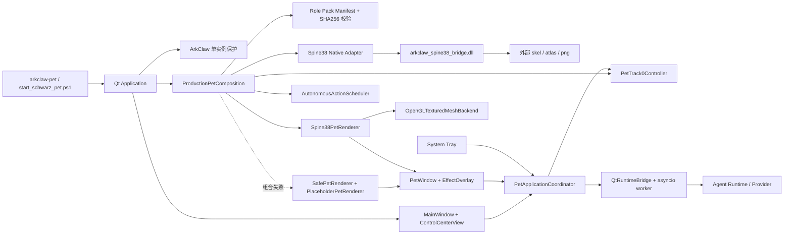

# ArkClaw 当前完整版桌宠架构交接文档

> 文档日期：2026-08-14  
> 交接对象：ArkClaw Windows 桌宠项目  
> 当前产品基线：`codex/arkpets-spine-idle-vertical-slice` 工作树中的现状  
> 目标：将该版本验收、提交后作为新的 `main` 主干基线

## 1. 交接结论

当前可用版本已经不是旧的 `sjtuclaw` 桌宠，而是一套以 `arkclaw` 为正式包名、以 Schwarz Spine 3.8 角色为首个生产角色的完整 Windows 桌宠实现。它包含：

- 透明桌宠窗口、桌面拖拽、落地和多显示器约束；
- Spine 3.8 原生运行时桥接与 OpenGL 网格渲染；
- Relax、Move、Sit、Sleep、Special、Interact 动作体系；
- 自动行为、用户点击、右键菜单、托盘和控制中心的统一动作调度；
- ArkClaw 控制中心窗口和桌宠右键展开栏；
- 角色包清单、素材哈希校验、角色切换事务和安全降级；
- Agent、OpenAI、DeepSeek、配置、凭据、开机启动和单实例能力；
- 单元测试、Qt 测试、原生桥接测试和 Windows 打包脚本。

建议把该版本作为后续唯一产品主线。旧 `src/sjtuclaw/` 对未来角色素材扩展没有必要，可以在主干切换完成并验证后删除；但 `PlaceholderPetRenderer`、`SafePetRenderer`、通用网格模型和 OpenGL 后端不是旧桌宠，应继续保留。

## 2. 当前版本状态与主干边界

### 2.1 当前事实

| 项目 | 当前状态 |
|---|---|
| 仓库主目录 | `D:\ArkClaw` |
| 当前 `main` | `8b573dd`，仍以 `src/sjtuclaw/` 为主要包 |
| 最新可用工作树 | `D:\ArkClaw\.worktrees\arkpets-spine-idle-vertical-slice` |
| 最新工作树分支 | `codex/arkpets-spine-idle-vertical-slice` |
| 分支当前提交 | `4511d32 docs: finalize Schwarz acceptance boundary contracts` |
| 最新完整实现 | 上述提交加工作树内尚未提交的 `src/arkclaw/`、UI、原生桥接改名、测试和文档改动 |
| 主干切换 | **尚未执行** |

因此，“当前版本作为主干”是已经确认的产品决策，但还不是 Git 中已经完成的状态。当前最新实现含大量未提交改动，只记录提交号无法完整恢复。交接时必须先保护并提交当前工作树，再切换 `main`。

### 2.2 建议的唯一事实来源

主干切换前，以下位置按优先级作为事实来源：

1. 当前运行代码：`src/arkclaw/`；
2. 当前正式启动入口：`scripts/start_schwarz_pet.ps1`；
3. 当前依赖声明：`pyproject.toml` 与 `uv.lock`；
4. 当前项目说明：`README.md` 与 `STRUCTURE.md`；
5. 具体设计记录：`docs/architecture/`、`docs/pet/`、`docs/rendering/`；
6. 历史实施过程：`docs/superpowers/`，仅用于追溯，不作为日常运行依据。

## 3. 产品与运行边界

ArkClaw 是一个本地优先的 Windows Desktop Companion。运行时由两个可见界面和一个后台协调层构成：

- **桌宠本体**：透明、无边框、长期驻留桌面，显示角色并接受点击、拖拽和右键操作；
- **控制中心**：管理当前角色、动作、交互、外观和系统设置，不代替桌宠本体；
- **系统托盘**：提供低打扰的常驻入口和快捷动作；
- **运行协调层**：统一处理动作来源、状态、Spine 播放、Agent 会话和安全退出。

当前生产角色是 Schwarz。角色图片、Spine 骨骼、图集和纹理均保持在仓库外部，仓库保存通用运行时、角色包协议和校验逻辑。

## 4. 项目目录架构

```text
ArkClaw/
├─ README.md                  # 启动、验收和运行说明
├─ STRUCTURE.md               # 工作树结构速查
├─ pyproject.toml             # Python 包、入口和直接依赖
├─ uv.lock                    # 可复现依赖锁定
├─ src/arkclaw/               # 当前正式产品源码
│  ├─ domain/                 # 领域模型、事件、策略和端口
│  ├─ application/            # 动作、状态、运动、角色包和 Agent 用例
│  ├─ bootstrap/              # 生产组合根
│  ├─ infrastructure/         # Native、Provider、配置和 Windows 适配器
│  ├─ presentation/qt/        # 桌宠、控制中心、菜单、托盘和渲染器
│  ├─ config/                 # 配置模型与加载规则
│  └─ security/               # 安全相关公共定义
├─ native/spine38_bridge/     # Spine 3.8 C++ 桥接 DLL
├─ tests/                     # unit、qt、integration 和 fakes
├─ scripts/                   # 启动、构建、检查和 smoke 脚本
├─ packaging/                 # Nuitka/Windows 打包和产物审计
├─ prototypes/                # 可独立运行的诊断性原型
├─ docs/                      # 架构、渲染、系统、Provider 和历史设计
└─ build/                     # 本机构建产物，不进入 Git
```

### 4.1 分层原则

| 层 | 职责 | 不应承担的职责 |
|---|---|---|
| `domain` | 稳定的业务类型、事件、策略、接口端口 | Qt、文件系统、网络和 Win32 细节 |
| `application` | 桌宠用例、动作仲裁、状态机、角色包和运行会话 | 创建具体窗口或直接调用原生 DLL |
| `infrastructure` | 端口的具体实现，如文件、Native、Provider、凭据 | 决定 UI 交互和产品流程 |
| `presentation/qt` | 窗口、输入、菜单、托盘、控制中心和渲染展示 | 重复实现业务状态机 |
| `bootstrap` | 组装具体实现并定义生产启动边界 | 承载可复用业务规则 |

这一分层的核心价值是：角色素材、渲染运行时、窗口 UI 和动作策略之间存在明确的替换缝隙。新增角色时应使用角色包接口，不应复制 `PetWindow` 或创建另一套角色专属应用。

## 5. 总体运行架构



## 6. 启动与组合过程

正式桌宠入口为：

```text
arkclaw.presentation.qt.pet_application:run
```

`pet_application` 的启动顺序如下：

1. 解析普通启动、开机启动和诊断参数；
2. 创建 `QApplication`，应用名和组织名均使用 ArkClaw；
3. 申请 `ArkClaw.Pet.SingleInstance.V1` 单实例锁；
4. 创建 `QtRuntimeBridge` 和常驻运行线程，使异步 Agent 不阻塞 GUI；
5. 创建 `MainWindow` 和 `ControlCenterView`；
6. 调用 `create_optional_production_pet_composition`；
7. 读取角色包 manifest，校验绝对路径、文件类型、SHA256 和 Spine 版本；
8. 打开原生 DLL，建立 Spine 运行时、动作目录、角色映射和渲染校准；
9. 注入 `Spine38PetRenderer`、Track 0 控制器和自动动作调度器；
10. 创建 `PetWindow`、效果溢出窗口、托盘和应用协调器；
11. 若生产组合失败，则关闭已创建的原生资源，并用安全占位渲染继续启动；
12. 退出时由协调器按顺序停止调度、线程、渲染资源和托盘。

生产组合是一个较深的模块：调用方只需要得到完整的 `ProductionPetComposition`，无需了解 DLL 句柄、动画目录、根运动分类和边界采样等内部细节。

## 7. 桌宠窗口、输入与布局

### 7.1 `PetWindow`

`PetWindow` 是透明桌宠的 Qt 宿主，负责：

- Windows 透明、无边框和置顶窗口生命周期；
- Qt 定时 tick；
- 鼠标点击、拖拽和右键菜单入口；
- 把运动、状态和动画请求委托给应用层；
- 接收渲染器输出，不直接解析 Spine 素材；
- 多显示器工作区、DPI/DPR 与窗口位置约束。

逻辑状态由 `PetAnimationEngine`、`PetMotionModel` 等应用层对象维护。Qt 窗口只驱动时钟和展示，避免窗口类变成难以测试的全能类。

### 7.2 可见区域与溢出窗口

角色常规身体窗口使用约 `160 × 180` 逻辑尺寸。Sit、Special 等动作可能超出身体窗口，因此由布局模型计算：

- **BODY surface**：桌宠正常身体和主要输入区域；
- **OVERFLOW surface**：承载超出身体框的视觉区域；
- `PetEffectOverlayWindow`：独立顶层透明窗口，展示溢出内容；
- `PetSurfaceHitFrame`：基于实际渲染 alpha 快照决定可点击区域；
- `PetPointerGesture`：使用系统拖拽阈值区分点击和拖动。

这套结构既保证特效不被裁剪，也避免透明区域无意义地拦截桌面操作。

### 7.3 用户输入

| 输入 | 当前行为 |
|---|---|
| 左键点击角色 | 请求 `Interact` |
| 左键拖拽 | 移动桌宠；释放后进入落地/约束流程 |
| 右键 | 打开 ArkClaw 桌宠展开菜单 |
| 托盘点击/菜单 | 打开控制中心或触发快捷动作 |
| 控制中心动作按钮 | 通过统一协调器请求正式动作 |

## 8. 动作与动画架构

### 8.1 统一动作模型

逻辑动作使用 `ProductionAction` 表示，当前包括：

- `RELAX`
- `MOVE_LEFT`
- `MOVE_RIGHT`
- `SIT`
- `SLEEP`
- `SPECIAL`
- `INTERACT`

动作来源按权限划分：

| 来源 | 示例 | 目的 |
|---|---|---|
| System | 移动、落地、生命周期 | 保证物理和窗口状态正确 |
| Explicit | 用户、托盘、控制中心、Agent | 用户意图优先，可追踪 |
| Autonomous | 空闲调度器 | 在没有更高优先级请求时提供自主行为 |

### 8.2 Track 0 播放链

```text
右键菜单 / 托盘 / 控制中心 / 点击 / 自动调度
    -> ProductionAction
    -> PetTrack0Controller
    -> AnimationRoleRegistry
    -> Spine38AnimationPlayer
    -> Spine38Runtime
    -> Native Bridge
    -> Spine Track 0
```

`PetTrack0Controller` 负责优先级、仲裁、取消、播放令牌、epoch 和完成事件。上层只提交逻辑动作，不直接写 Spine 动画名称，从而使同一套交互可以映射到不同角色素材。

Schwarz 的 `MOVE_LEFT` 和 `MOVE_RIGHT` 共用物理动画 `Move`，通过 `MIRROR_MOVE` 策略进行水平镜像。未来角色可以继续使用镜像策略，也可以通过角色能力模型扩展为独立左右动画。

### 8.3 自动行为

`AutonomousActionScheduler` 在没有显式动作占用时调度空闲行为。它不能绕过 Track 0 仲裁器，因此用户操作、系统运动和自动动作不会各自直接争抢 Spine 轨道。

## 9. Spine 3.8 渲染架构

### 9.1 Native Bridge

原生模块位于 `native/spine38_bridge/`：

- CMake 最低版本：3.25；
- C++ 标准：C++17；
- 产物：`build/spine38/Release/arkclaw_spine38_bridge.dll`；
- 静态链接固定版本的 Spine C++ runtime；
- 提供独立原生 contract test；
- 构建时复制 Spine runtime LICENSE。

Spine runtime 固定信息：

| 字段 | 值 |
|---|---|
| 仓库 | `https://github.com/EsotericSoftware/spine-runtimes.git` |
| 提交 | `8b4844bd4b193ba9e54487ed397a777993cbad56` |
| 数据版本 | `3.8` |

固定提交非常重要。Spine 二进制数据与运行时版本存在兼容边界，不能在未重新验收素材的情况下随意升级 runtime。

### 9.2 Python 到渲染后端

| 模块 | 作用 |
|---|---|
| `Spine38NativeLibrary` | 用 `ctypes` 适配 C ABI、管理原生句柄和错误 |
| `Spine38Runtime` | 面向应用层的框架无关运行时接口 |
| `Spine38AnimationPlayer` | 把 Track 0 请求适配为 Spine 播放并回传事件 |
| `Spine38PetRenderer` | 将 Spine 网格转换为渲染器中立的 `PetMeshScene` |
| `OpenGLTexturedMeshBackend` | Qt/OpenGL 的正式纹理网格后端 |
| `SafePetRenderer` | 隔离初始化和绘制异常，切换安全 fallback |
| `PlaceholderPetRenderer` | 生产故障时仍可见、可退出的程序化降级渲染 |

`pet_mesh_model.py` 和 `pet_mesh_opengl_renderer.py` 已经属于正式 Spine 渲染链，不能当成旧桌宠删除。`pet_mesh_spike.py` 是历史验证实现，可在正式后端长期稳定后单独评估移除。

## 10. 控制中心与右键展开栏

### 10.1 控制中心

`ControlCenterView` 是当前 ArkClaw 管理窗口，包含：

- Home：当前角色、状态、动作和快捷入口；
- My Pets：已安装角色与后续角色管理入口；
- Animations：动作预览和显式动作触发；
- Interaction：点击、拖拽、右键与行为规则；
- Appearance：尺寸、缩放、位置、透明度、置顶和质量设置；
- Settings：启动、更新、性能、托盘与通知；
- 右侧详情/检查器区域；
- 小窗口下可收缩的侧边栏。

当前 Home 和 Animations 页发出逻辑动作名，由 `PetApplicationCoordinator` 转换为 `ProductionAction`，因此控制中心不直接依赖 Spine 动画文件名。

### 10.2 桌宠右键展开栏

桌宠右键菜单和托盘菜单共享 ArkClaw 视觉样式与 `ProductionActionMenuSection`。菜单包含：

- 打开 ArkClaw 控制中心；
- Interact、Relax、Sit、Sleep、Special；
- Move 子菜单；
- 系统相关操作和安全退出。

菜单触发仍走统一动作协调链，不另建一套播放器。

### 10.3 UI 所有权

`MainWindow` 持有控制中心和运行时桥接，`PetApplicationCoordinator` 负责连接：

```text
Control Center <-> Coordinator <-> PetWindow / Track0
System Tray    <-> Coordinator <-> Runtime Bridge
Context Menu  <-> Coordinator <-> Safe Shutdown
```

这样可以保持窗口之间同步，并避免控制中心、右键菜单和托盘分别维护当前动作状态。

## 11. 角色素材扩展架构

### 11.1 角色包 manifest

当前角色包 schema 为 v1，主要字段如下：

```yaml
schema_version: 1
pack_id: schwarz-production
spine_version: "3.8"
assets:
  skeleton: absolute/path/to/character.skel
  atlas: absolute/path/to/character.atlas
  texture: absolute/path/to/character.png
expected_sha256:
  skeleton: "..."
  atlas: "..."
  texture: "..."
animations:
  relax: Relax
  move: Move
  sit: Sit
  sleep: Sleep
  special: Special
  interact: Interact
direction_policy: mirror_move
framing:
  scale: 1.0
  x_offset: 0.0
  foot_baseline: 180.0
texture_page_count: 1
```

当前约束：

- `schema_version` 必须为 1；
- `spine_version` 必须为 3.8；
- `.skel`、`.atlas`、`.png` 使用绝对路径；
- 三个文件必须通过 SHA256 校验；
- 当前只支持一个纹理页；
- 通用协议中 `relax` 必需，其余动作可以声明为可选；
- Schwarz 正式组合目前调用 `require_schwarz_production()`，要求当前七个逻辑动作全部可用。

### 11.2 新角色接入建议

新增角色应复用以下流程：

1. 准备 Spine 3.8 的 `.skel`、`.atlas`、`.png`；
2. 创建角色包 manifest 并记录素材哈希；
3. 建立逻辑动作到物理动画名称的映射；
4. 配置缩放、水平偏移和脚底基线；
5. 运行边界采样，确认 BODY/OVERFLOW 布局；
6. 验证点击 alpha、拖拽、移动镜像和动作完成事件；
7. 通过 `pet_role_pack_switch.py` 的两阶段事务切换角色；
8. 将角色显示信息接入 My Pets，而不是复制桌宠窗口。

后续应把 `require_schwarz_production()` 演进为“角色能力声明 + 页面按能力启用”，这样缺少 Special 或 Sit 的角色也能合法安装。该项目前属于后续设计，不应在没有需求确认时假设所有角色都具备 Schwarz 的完整动作集合。

## 12. Agent、Provider 与线程模型

### 12.1 Agent 运行时

Agent 逻辑位于 `application`，Qt 通过 `QtRuntimeBridge` 与常驻 worker thread 中的 asyncio event loop 交互。GUI 线程不直接执行网络请求，避免桌宠动画和窗口输入被冻结。

### 12.2 Provider 状态

| Provider | 当前状态 | 备注 |
|---|---|---|
| Fake | 已实现 | 测试和本地确定性验证 |
| OpenAI | 已实现 | 使用官方 SDK 与 Responses 协议 |
| DeepSeek | 已实现 | 独立 Chat Completions 适配器 |
| Ollama | 仅识别/可配置 | Adapter 尚未实现，会抛出明确的 `ProviderNotImplementedError` |

普通桌宠启动不会自动发送云请求。只有用户配置 Provider 并触发对应 Agent 流程时才进入网络适配器。

## 13. 配置、凭据与 Windows 集成

| 能力 | 当前实现 |
|---|---|
| 普通配置 | 本地 JSON repository，非敏感数据原子写入 |
| Provider profile | `%LOCALAPPDATA%\ArkClaw\provider_profiles.json` |
| API 密钥 | Windows Credential Manager，target 使用 `ArkClaw/...` |
| 开机启动 | 当前用户 `HKCU\...\Run` |
| 单实例 | `ArkClaw.Pet.SingleInstance.V1` |
| 系统托盘 | Qt System Tray，提供控制中心、动作和退出 |

旧 SJTUClaw 的 Provider 元数据、凭据 target 和用户配置不会自动迁移到 ArkClaw 命名空间。是否提供迁移工具目前为 **Unknown**，需要产品和隐私策略确认。

## 14. 项目依赖

### 14.1 Python 与直接依赖

| 类型 | 声明 | 当前锁定/说明 |
|---|---|---|
| Python | `>=3.12,<3.14` | 推荐 Python 3.12 |
| 构建后端 | `setuptools>=75` | PEP 517 构建 |
| 核心运行时 | `openai==2.48.0` | Agent Provider SDK |
| GUI extra | `PySide6==6.11.1` | Qt 6 桌面 UI、OpenGL、托盘 |
| 开发 | `pytest>=8.3` | lock 中为 9.1.1 |
| 开发 | `mypy>=1.14` | lock 中为 2.3.0，strict 模式 |
| 开发 | `ruff>=0.9` | lock 中为 0.16.0 |
| 打包 | `Nuitka==4.0` | Windows standalone |

关键传递依赖由 `uv.lock` 固定，包括：

- `shiboken6`、`PySide6-Essentials`、`PySide6-Addons` 6.11.1；
- `pydantic` 2.13.4、`pydantic-core` 2.46.4；
- `httpx` 0.28.1、`httpcore` 1.0.9、`anyio` 4.14.2；
- `jiter` 0.16.0、`typing-extensions` 4.16.0；
- `tqdm` 4.69.0、`certifi` 2026.7.22。

依赖升级应以 `uv.lock` 为一个整体更新并执行桌宠、Provider、原生桥接和打包回归，不建议只手工升级某个 Qt 或 OpenAI 包。

### 14.2 系统与原生依赖

| 依赖 | 用途 |
|---|---|
| Windows 10/11 | 透明窗口、托盘、Credential Manager、HKCU Run |
| PowerShell 5.1 或 7 | 开发启动、构建与 smoke 脚本 |
| `uv` | 虚拟环境和锁文件同步 |
| CMake 3.25+ | 构建 Spine 3.8 bridge |
| C++17 编译器 | 编译 native bridge |
| Visual Studio C++ Build Tools / MSVC | Windows 原生构建和 Nuitka 打包 |
| OpenGL 驱动 | Qt 纹理网格渲染 |
| Spine C++ runtime 固定提交 | 读取 Spine 3.8 二进制素材 |

## 15. 可执行入口

`pyproject.toml` 当前声明：

| 命令 | 入口 | 定位 |
|---|---|---|
| `arkclaw-pet` | `arkclaw.presentation.qt.pet_application:run` | 正式桌宠入口 |
| `arkclaw-gui` | `arkclaw.presentation.qt.application:run` | 普通 Qt/Agent 窗口入口 |
| `arkclaw-agent-demo` | `arkclaw.__main__:main` | Agent 命令行演示 |
| `arkclaw-pet-placeholder` | 与 `arkclaw-pet` 相同 | 历史兼容别名，非默认入口 |

开发工作树应优先用 `start_schwarz_pet.ps1`，因为共享虚拟环境中的 editable install 可能仍指向另一个工作树；该脚本会显式设置当前 `src` 为 `PYTHONPATH`。

## 16. 构建、启动与验收命令

以下命令均在当前最新工作树中运行：

```powershell
Set-Location 'D:\ArkClaw\.worktrees\arkpets-spine-idle-vertical-slice'
```

### 16.1 第一次准备

```powershell
uv sync --extra gui --extra dev --extra packaging
powershell -NoProfile -ExecutionPolicy Bypass -File .\scripts\build_spine38_bridge.ps1
```

### 16.2 验证路径和素材，不打开窗口

```powershell
powershell -NoProfile -ExecutionPolicy Bypass -File .\scripts\start_schwarz_pet.ps1 -ValidateOnly
```

### 16.3 启动当前正式桌宠

```powershell
powershell -NoProfile -ExecutionPolicy Bypass -File .\scripts\start_schwarz_pet.ps1
```

需要查看控制台错误时：

```powershell
powershell -NoProfile -ExecutionPolicy Bypass -File .\scripts\start_schwarz_pet.ps1 -Console
```

素材不在默认路径时：

```powershell
powershell -NoProfile -ExecutionPolicy Bypass -File .\scripts\start_schwarz_pet.ps1 `
  -AssetRoot 'D:\你的素材目录'
```

### 16.4 Schwarz 集成 smoke

```powershell
powershell -NoProfile -ExecutionPolicy Bypass -File .\scripts\start_schwarz_pet.ps1 -Smoke
```

### 16.5 开发回归

```powershell
.\.venv\Scripts\python.exe -m pytest
.\.venv\Scripts\python.exe -m ruff check src tests scripts packaging
.\.venv\Scripts\python.exe -m mypy src tests scripts packaging
```

如果工作树自身没有 `.venv`，当前脚本会尝试使用仓库共享环境 `D:\ArkClaw\.venv`；手工执行测试时也应选择实际存在且已同步的解释器。

## 17. 人工验收要点

切换主干前至少检查：

1. 启动后显示 Schwarz，而不是程序化旧桌宠；
2. 桌宠透明、无边框，角色边缘和纹理正常；
3. 左键点击触发 Interact，拖拽不误触点击；
4. 释放后正确落地，桌宠不会跑出当前显示器工作区；
5. Relax、Move Left、Move Right、Sit、Sleep、Special 全部可播放；
6. Move 左右方向镜像正确；
7. Sit、Special 超出身体框的部分不被裁剪；
8. 透明溢出区域不大面积拦截桌面点击；
9. 桌宠右键展开栏样式、动作项和 Move 子菜单正常；
10. “Open ArkClaw Control Center” 能打开当前控制中心；
11. 控制中心 Home、My Pets、Animations、Interaction、Appearance、Settings 均可切换；
12. Home 和 Animations 中的动作能驱动桌宠；
13. 托盘可以打开控制中心、触发动作和安全退出；
14. 重复启动只保留一个实例；
15. 主屏、副屏、不同缩放比例和任务栏位置下均不越界；
16. 缺少 manifest、素材损坏或 DLL 加载失败时，程序安全降级且仍可退出；
17. 退出后无残留桌宠窗口、托盘图标和 worker 线程。

## 18. 旧桌宠清理决策

### 18.1 主干切换后可以删除

| 对象 | 结论 | 原因/前置条件 |
|---|---|---|
| `src/sjtuclaw/**` | 删除 | 新正式包已经是 `src/arkclaw/**`；先确认所有导入和入口已迁移 |
| `sjtuclaw-*` 旧入口和包元数据 | 删除 | 不应继续暴露旧产品命名；先检查外部脚本和开机启动项 |
| 只启动旧包的脚本 | 删除或改为 ArkClaw | 防止验收时再次启动旧版本 |
| 旧 SJTUClaw 品牌、命名空间和重复配置 | 删除 | 避免产生两套配置和单实例标识 |
| 已失效的旧 worktree 记录 | 清理 | 先备份、确认无未提交内容，再使用 Git 的 worktree 清理流程 |

### 18.2 暂时保留，后续可评估

| 对象 | 建议 | 原因 |
|---|---|---|
| `arkclaw-pet-placeholder` 命令别名 | 暂留 | 可能仍被旧快捷方式或自动启动调用；完成迁移后删除 |
| `prototypes/placeholder_pet/` | 暂留 | 低成本的无素材诊断入口；若确认不再用于故障排查可删 |
| `pet_mesh_spike.py` 及对应 spike 脚本/测试 | 后续评估 | 属于实验验证路径，不是生产后端；先确认无回归价值 |

### 18.3 必须保留

| 对象 | 必须保留的原因 |
|---|---|
| `PlaceholderPetRenderer` | 生产 Spine 初始化或绘制失败时的安全降级，不是旧产品 |
| `SafePetRenderer` | 隔离 renderer 故障，避免桌宠崩溃或无法退出 |
| `PetRenderer` Protocol | 保持 UI 与具体渲染实现解耦 |
| `pet_mesh_model.py` | Spine 正式渲染器使用的中立网格模型 |
| `pet_mesh_opengl_renderer.py` | 当前 Spine 正式 OpenGL 后端 |
| 角色包 manifest、registry 和 switch | 未来多角色扩展的核心接口 |
| 素材加载和 SHA256 校验 | 防止错误角色包或损坏素材进入 Native runtime |
| Track 0、动作序列和自动调度 | 所有角色共享的动作编排基础 |
| fake adapter 和测试替身 | 保持离线、确定性测试能力 |

判断标准不是“是否看起来像占位桌宠”，而是它是否仍承担正式系统中的接口、故障隔离或测试职责。

## 19. 当前版本进入 `main` 的交接清单

本任务不执行代码或 Git 修改。后续执行者应按以下顺序完成主干切换：

1. 在当前工作树检查 `git status`，确认所有改动的来源和所有者；
2. 备份或提交完整 `src/arkclaw/`、UI、Native 改名、脚本、测试和文档；
3. 确认 Git 中不再出现误删用户工作或遗漏未跟踪文件；
4. 运行 `-ValidateOnly` 和 Schwarz `-Smoke`；
5. 运行完整 pytest、Ruff 和 Mypy；
6. 完成第 17 节人工验收，尤其是多显示器、右键菜单和控制中心；
7. 记录已知的 autostart/DPI probe 超时是否属于环境问题；
8. 将已提交、可复现的当前分支合并或快进到 `main`；
9. 从全新的 clone/虚拟环境重新构建 Native DLL 并启动一次；
10. 只有在新 `main` 可复现后，才删除旧 `src/sjtuclaw/` 和失效 worktree；
11. 更新所有快捷方式、开机启动和文档，使其只指向 `arkclaw-pet`；
12. 再次运行全套验收，确认没有从共享 `.venv` 意外加载旧包。

不建议直接在未提交工作树上删除旧目录或强制移动分支，因为当前最新版尚不能只靠提交号恢复。

## 20. 已知风险与 Unknown

| 项目 | 状态 |
|---|---|
| 最新实现尚未提交 | 高优先级风险；应先建立可恢复基线 |
| `main` 仍是旧包 | 已知；主干切换待执行 |
| 共享 `.venv` 可能指向其他工作树 | 已通过启动脚本的 `PYTHONPATH` 规避，主干切换后应重建环境 |
| 完整测试中的 autostart/DPI probe 超时 | 已观察到；需要在目标 Windows 环境复核，不应误报为全部测试通过 |
| Schwarz 素材分发授权 | **Unknown**；素材当前在仓库外，正式发布前需法律/产品确认 |
| 多纹理页角色支持 | 当前不支持；是否需要为 **Unknown** |
| 不同 Spine 数据版本 | 当前只支持 3.8；升级计划为 **Unknown** |
| 旧 SJTUClaw 用户数据迁移 | **Unknown**；需确定是否提供显式迁移 |
| Ollama Provider | 仅配置层存在，运行 adapter 未实现 |
| 更新系统和下载角色商店 | UI 可预留，但实际业务能力为 **Unknown**，不能当成已实现功能 |

## 21. 打包与发布

当前 Windows standalone 使用 Nuitka 4.0，预期产物：

```text
dist/ArkClaw.dist/ArkClaw.exe
```

部署配置包含 Qt Core、Gui、Widgets、Network，并关闭生产控制台。发布前还需确认：

- Spine bridge DLL 被正确带入产物；
- Visual C++ runtime 和 OpenGL 环境满足要求；
- 外部角色素材的安装位置、授权和更新机制；
- `%LOCALAPPDATA%\ArkClaw` 写入权限；
- Credential Manager 与开机启动在打包环境中正常；
- 全新用户环境不存在对开发工作树、共享 `.venv` 或 `D:\Spine` 的依赖。

角色素材如何随安装包分发目前为 **Unknown**，在授权和资源管理方案确定前应继续保持外置。

## 22. 后续维护原则

1. `src/arkclaw/` 是唯一正式 Python 包；
2. 角色差异进入 role pack，不进入第二套 PetWindow；
3. UI 只发逻辑动作，不直接引用 Spine 动画名；
4. 所有动作来源统一经过 Track 0 仲裁；
5. Native 版本与 Spine 数据版本一起固定和验收；
6. 外部素材必须通过 manifest 和哈希校验；
7. 安全 fallback 属于生产可靠性边界，不与旧桌宠一起删除；
8. 控制中心、右键菜单和托盘共享动作与状态来源；
9. 未实现的下载、更新、多纹理页和商店能力继续标记为 Unknown；
10. 每次主干发布必须能从干净环境复现，不依赖未提交文件。

---

交接时最重要的三件事：先把当前工作树变成可恢复提交；再让它真正成为 `main`；最后才清理旧 `sjtuclaw`，并保留所有仍服务于角色扩展、生产渲染和故障降级的通用模块。
