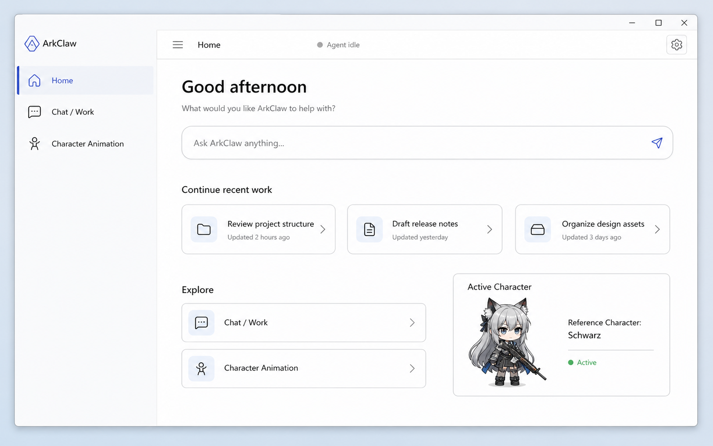
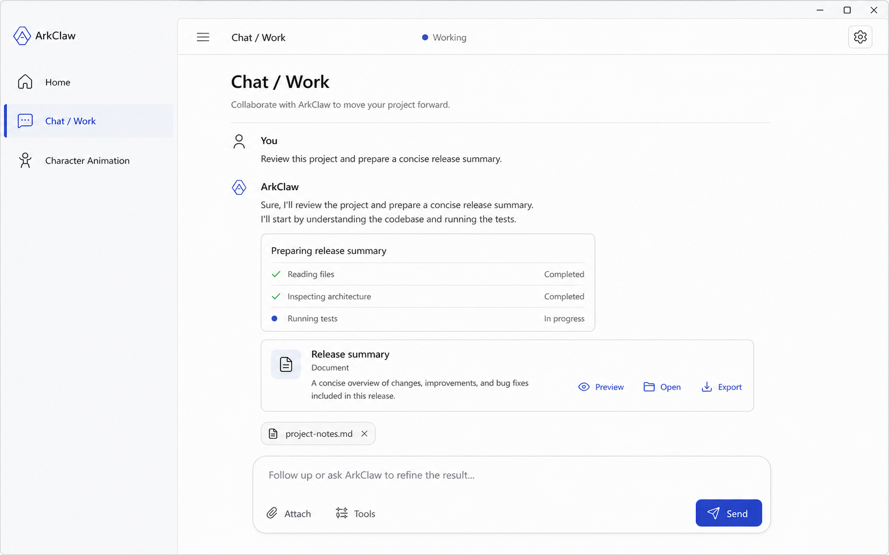
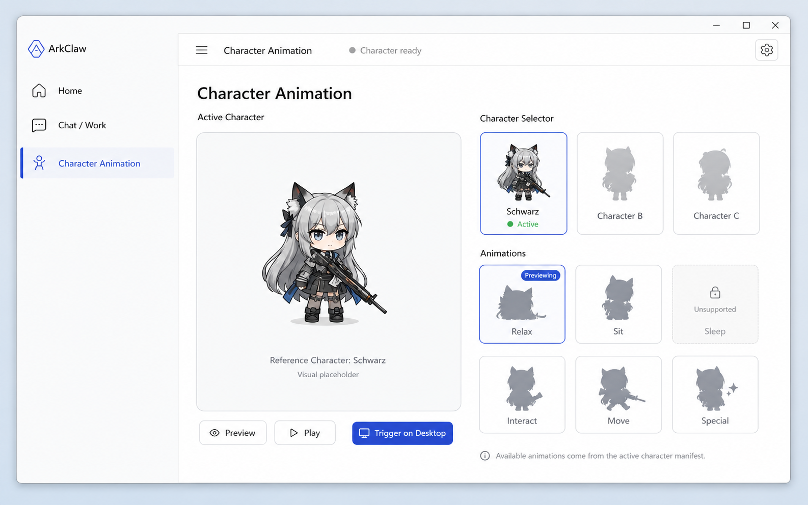
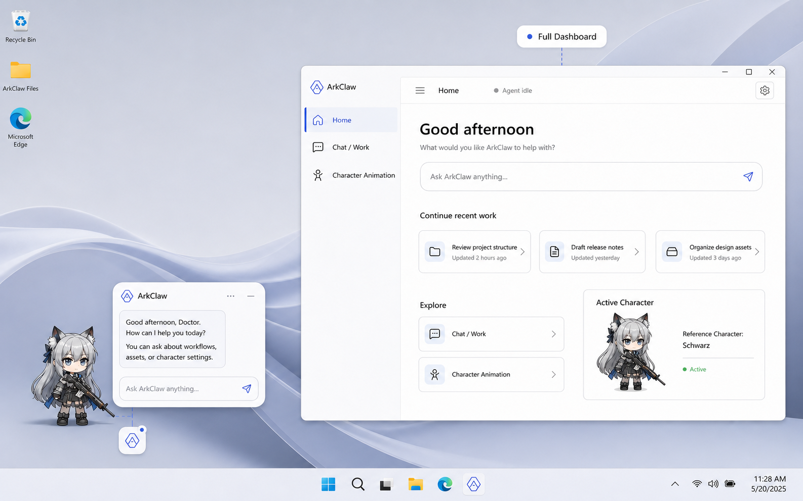
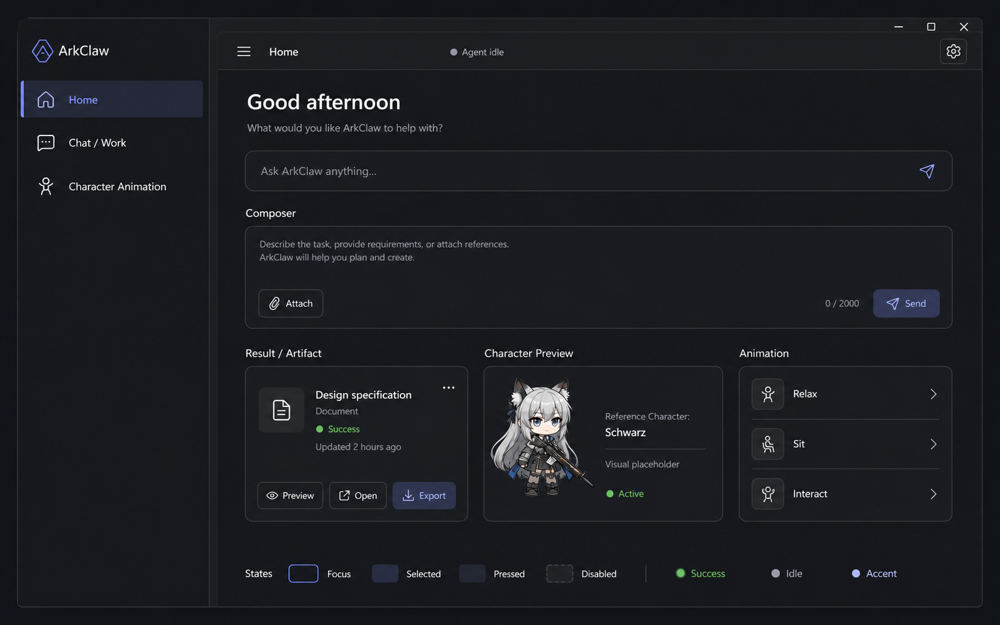

# ArkClaw Visual Design System v1

## 0. Document Status and Authority

| Field | Frozen value |
|---|---|
| Phase | Visual Design Freeze v1 |
| Type | Canonical Visual Specification |
| Status | **VISUAL_FREEZE_COMPLETE / READY_FOR_VISUAL_FREEZE** |
| Units | Qt logical pixels unless stated |
| Interaction authority | `docs/design/06-interaction-freeze-and-prototype-review.md` |
| Token authority | `docs/design/visual-freeze-v1.tokens.json` |
| Concept assets | `docs/design/visual-freeze-v1/` |

本文冻结用户可见的 V1 产品模型、视觉语言、几何、主题、组件状态和跨 Surface 一致性。若与 06 的交互语义冲突，以 06 为准；本文不改变 backend、native window、input routing、PetWindow 或 Spine renderer 架构，也不包含 Qt production code。

> **Active Character 负责角色感、动画表达与桌面 embodiment；ArkClaw UI 负责稳定、统一、Character-Agnostic 的现代产品体验。**

## 1. Product Model

```text
ArkClaw
├── Desktop Companion
│   ├── Active Character
│   ├── Action Palette
│   └── Conversation Capsule
└── Full Dashboard
    ├── Home
    ├── Chat / Work
    └── Character Animation
```

### Desktop Companion

用于桌面陪伴、角色表达和短时快速交互。默认只有 Active Character；Palette 与 Capsule 按需出现，不形成常驻工具条或大窗口。

### Full Dashboard

用于主动进入 ArkClaw、最近工作、持续对话、附件输入、Agent 工作、结果与角色动画管理。Dashboard 是独立应用窗口，不锚定桌面角色。

### V1 Scope

- Dashboard 一级导航只有 Home、Chat / Work、Character Animation。
- Settings 是 Top App Shell 右侧 40 × 40 辅助入口。
- 上传只在 Chat / Work Composer；没有 Materials 一级页面。
- 角色资产为可替换的 Arknights-style chibi / small Spine characters。

### Future Scope

Materials Library、Projects、Standalone Tasks、Full File Manager、Tool/Model/Plugin Manager、Multi-Agent、Character marketplace、Advanced Character Library、Animation Editor/Timeline、Developer Mode、IDE-like Workspace、Permanent Activity Inspector、Advanced Artifact Manager 均不属于 V1。

## 2. Visual Direction

| Reference | ArkClaw mapping | Boundary |
|---|---|---|
| Chrome | 轻量 App Shell、克制控件 | 无 tabs、URL bar、密集 toolbar |
| Chrome + Gmail | 导航、功能组织、选中态 | 不复制 Google 品牌构图 |
| Gemini | Conversation、Composer、内容优先 AI Work | 不做左右气泡或 ChatGPT clone |
| Google Material | 共享 token、图标、状态、可访问性 | 不机械套默认组件 |
| Active Character | 角色身份、chibi Spine embodiment | 不用角色主题重绘系统 UI |

Visual signature：近白/石墨中性色、低面积蓝紫强调、边框主导卡片、柔和大圆角输入面、Segoe UI 系字体、1.75 px 线性图标、低频有意义动效。

禁止：game HUD、cyberpunk、neon、black tactical、Arknights operator page、IDE、VS Code workspace、permanent file tree、terminal、tool inspector、dense settings、glassmorphism、持续 glow、BI dashboard、传统左右聊天气泡。

### Character-Agnostic Principle

90–95% 视觉由 neutral ArkClaw system 决定；5–10% 可选角色 accent 只进入 preview backdrop、selection marker、小面积 status tint。换角色不得改变 global accent、navigation、composer、字体、主题、半径或状态语言。

## 3. Design Principles

1. **Character First**：桌面默认只有 Active Character。
2. **UI on Demand**：Palette、Capsule、Dashboard 只在对应复杂度出现。
3. **Dashboard on Demand**：复杂任务进入独立 Dashboard，不无限放大 Capsule。
4. **Progressive Disclosure**：Conversation → Task State → Activity → Result 在同一页面出现。
5. **Content Before Chrome**：内容、任务和结果优先。
6. **Calm Desktop**：无常驻工具条、仪表或遥测。
7. **Spatial Honesty**：浮层靠近角色但不遮挡；Dashboard 独立定位。
8. **State Truth**：只呈现已确认事实，动效不承担语义真相。
9. **Accessible by Default**：键盘、Focus、对比度、Reduced Motion 从 V1 成立。
10. **Qt-realistic**：不依赖 blur、粒子、复杂 shader 或持续 GPU 特效。

## 4. Character Model

### Active Character

`Active Character` 是产品级术语。动态标题用 `Character · {ActiveCharacterDisplayName}`，无法安全取名时用 `Active Character`；系统动作统一为 `Hide Character`。

### Reference Character

Schwarz 仅是 **Reference Character**，用于验证 chibi Spine 尺寸、对比与控制；不得进入固定菜单名、通用标题、全局主题或产品语义。

### V1 Spine Asset Scope

V1 是 replaceable Arknights-style chibi / small Spine characters，不是 Live2D、3D、GIF 或静态 PNG 角色系统。概念图非真实兼容 Spine frame 时必须标记 `Visual placeholder`。

### Character Accent Limits

允许 preview backdrop、selector marker、小 status tint；禁止 global accent replacement、navigation recolor、composer skin、character-specific theme、game HUD ornament。

## 5. Shared Visual Tokens

组件只引用 semantic token。

### Color

| Token | Light | Dark | Use |
|---|---:|---:|---|
| `background` | `#F6F8FC` | `#17181B` | 大背景 |
| `surface` / `surface-card` | `#FFFFFF` | `#222327` | 基础面、cards |
| `surface-nav` | `#F2F5FA` | `#1D1E22` | Navigation |
| `surface-subtle` | `#F7F8FA` | `#27292E` | 辅助/disabled |
| `surface-input` | `#F1F3F7` | `#292A2F` | Input |
| `surface-hover` / `surface-selected` | `#EEF0FF` | `#30344F` | Hover/selected |
| `surface-active` | `#E3E7F8` | `#383D57` | Pressed/active |
| `text-primary` | `#202124` | `#F1F3F4` | 主文本 |
| `text-secondary` | `#5F6368` | `#BDC1C6` | 次文本 |
| `text-tertiary` / `text-disabled` | `#6F747B` / `#6B7077` | `#9AA0A6` | Caption/disabled |
| `icon` | `#5F6368` | `#BDC1C6` | Icon |
| `border` / `divider` | `#DADCE0` / `#E4E7EB` | `#3C4043` / `#34363B` | Boundary |
| `accent` / `accent-hover` | `#5B6FD8` / `#4F61C6` | `#AEB7FF` / `#C2C8FF` | 主动作 |
| `accent-soft` | `#EEF0FF` | `#30344F` | Accent layer |
| `focus` | `#5066D6` | `#C6CCFF` | Focus ring |
| `danger` / `danger-soft` | `#B3261E` / `#FCE8E6` | `#FFB4AB` / `#4B2525` | Error |
| `warning` | `#8A5A12` | `#F2C36B` | Needs Attention |
| `success` | `#3C7A57` | `#8DD8A7` | Completed |

### Typography

Font：`Segoe UI Variable Text`, `Microsoft YaHei UI`, `Segoe UI`, sans-serif。

| Role | Size / line | Weight |
|---|---:|---:|
| display | 28 / 36 | 600 |
| page-title | 24 / 32 | 600 |
| title | 22 / 30 | 550 |
| section | 16 / 24 | 600 |
| composer | 15 / 22 | 400 |
| body | 14 / 20 | 400 |
| label / navigation | 14 / 20 | 500 |
| agent-status | 12 / 18 | 500 |
| caption | 12 / 16 | 400 |

### Spacing

Scale：4, 8, 12, 16, 20, 24, 32, 40, 48。Mapping：App Shell 16；Navigation 12；Page gutter 40；Compact gutter 32；Home card 20；Composer 16；Conversation gap 24；Character preview gap 24；Animation grid 16。

### Radius

Navigation row 12；Button 12；Card 16；App content 16；Palette 16；Composer 24；Capsule 24。`pill` 只用于确有需要的 compact status/chip。

### Elevation

- Dashboard Card：`0 1 2 rgba(32,33,36,.08)` + 1 px border。
- Composer：`0 4 16 rgba(32,33,36,.12)` + `0 1 4 rgba(32,33,36,.08)`。
- Palette/Popover：`0 8 24 rgba(32,33,36,.16)` + `0 2 6 rgba(32,33,36,.08)`。
- Capsule：`0 12 36 rgba(32,33,36,.18)` + `0 2 8 rgba(32,33,36,.08)`。

### Icons

Material-inspired line icons，1.75 px stroke；navigation/action 20，small 16，file/image 18，Thinking glyph 20；独立 icon button hit target 40 × 40。Inventory：Home、Chat / Work、Character Animation、Settings、Attach File/Image、Folder Context、Artifact、Open、Export、Retry、Send。

### Motion and Reduced Motion

| Motion | ms | Treatment |
|---|---:|---|
| Hover / press | 100 / 80 | surface only |
| Palette open / close | 160 / 110 | 4 px + opacity; open scale .98 |
| Palette layer forward/back | 150 / 140 | 6 px + crossfade |
| Capsule expand | 220 | geometry + opacity |
| Navigation expand/collapse | 180 | width + label opacity |
| Page change | 160 | 4 px + crossfade |
| Chat → Work | 200 | 4 px + crossfade |
| Result insertion | 160 | 4 px + opacity |
| Character switch | 180 | preview crossfade |
| Animation preview | 140 | crossfade |
| Context Pane | 180 | 8 px + opacity |

Motion 全部可取消、state-driven、不得宣告未发生结果。Reduced Motion 统一 60 ms crossfade，移除 translate/scale 与循环 pulse。

## 6. Desktop Companion

### Active Character

桌面常驻 embodiment；默认无 panel、toolbar、nameplate 或 HUD。角色主体保持无遮挡。

### Action Palette

保留成熟 baseline：width 304、row 44、radius 16、中性 surface、克制 elevation、20 px / 1.75 px icons；outer padding 8、row h-padding 12、section gap 8、anchor gap 12、work-area margin 12。ROOT 信息架构按 06 不变。状态：normal、hover、pressed、focus、disabled、checked、submenu available；focus 2 px，disabled reason 保持可读。

Character Layer 标题为 `Character · {ActiveCharacterDisplayName}` 或 `Active Character`，动作来自 capability。System Layer 固定使用 `Hide Character`，不得拼接 Reference Character 名称。

### Conversation Capsule

| Property | Value |
|---|---:|
| Width | 480–640；preferred 560 |
| Typical height | 184–360 |
| Radius / padding | 24 / 24 |
| Input height / h-padding | 56 / 16 |
| Send hit/visible | 40 / 36 |
| Anchor gap / work margin | 24 / 16 |

Capsule 用于短对话、短答案和一次确认；复杂内容、长任务、附件或 artifact 进入 Dashboard > Chat / Work。共享 ConversationContext、draft、revision、IME。状态：closed、opening、empty、focused、typing、IME composing、submitting、thinking、responding、short response、error、retry、offline、disabled、handoff、closing。

### Desktop Anchor / Edge Placement

Palette/Capsule 靠近角色但不遮挡、不越 work area、不压任务栏；空间不足按 06 翻转/夹紧，视觉 gap 不变。

## 7. Full Dashboard App Shell

### Window and Top App Shell

独立 Windows 应用窗口；default 1280 × 800，minimum 1024 × 680，global content max 1120。外部 Windows radius/system buttons 不重定义。内部 top bar 56：40 × 40 nav toggle、page title、可选 task state、Settings/overflow。无 browser tabs、URL bar、global search、dense toolbar。

### Navigation Rail

只有 Home、Chat / Work、Character Animation。Expanded 208，collapsed 72，padding 12，row 44/radius 12，leading inset 16，icon 20，gap 12，indicator 3 × 24，toggle 40 × 40。Active=`surface-selected` + accent icon + medium label + leading indicator。Collapsed 有 tooltip/accessibility name；focus 2 px。Settings 不进 rail。

### Responsive / Minimum Size

≥1180 使用 expanded rail + 40 gutter；1024–1179 可 collapsed rail + 32 gutter。低于 1024 × 680 不再缩 frozen minima。Context Pane 优先压缩辅助留白，不损害 conversation 可读性。

## 8. Home

```text
Home
├── Greeting / Introduction
├── Primary Ask
├── Continue Recent Work
├── Active Character Summary
└── Explore → Chat / Work; Character Animation
```

Content max 1040；top pad 40；gutter 40/32；greeting 28/36/600；Ask max 720 × 64/radius 24；section gap 32；card padding 20；recent card min 280 × 112；Active Character Summary preferred 320 × 220；同一 viewport 最多三张 recent cards。

First Launch 显示欢迎、Ask、Explore；No Recent Work 用短说明 + `Start Chat / Work`，不显示空 grid；Recent Work 最多三卡；Agent Idle 无 active block；Agent Working 用轻量 task state 指向 Chat / Work；Character unavailable 用内联原因+恢复，不替换全页。禁止 CPU、RAM、token graph、KPI、Agent score、telemetry、charts、BI cards。

## 9. Chat / Work

```text
Chat / Work
├── Conversation
├── Task State
├── Activity          (when needed)
├── Result / Artifact (when available)
└── Composer
```

Conversation → Task State → Activity → Result → Follow-up 在同一页面，不进入 IDE。Page max 920；conversation 720；Composer max 800、height 104–240、radius 24、padding 16；bottom clearance 24；Activity row min 36；Result max 720、radius 16、padding 20。

### Conversation and Composer

Gemini-like：content-first、large whitespace、typographic hierarchy、minimal container、light metadata；不用左右气泡。Composer 支持 multiline、file、image、folder/project context、attachments、future tools slot、send；底行只有 Attach、可选 Tools、Send。15/22/400 与 Capsule 同族。IME 期间 Enter 不误提交；上传/Agent 状态变化不清 draft。

### Attachment

Chip height 32/max 220/h-padding 10；file/image icon 18；remove target 32 × 32；image preview 72 × 72；Attach 40 × 40。状态：Selected locally、Uploading、Uploaded、Failed、Removed、Unsupported、Too large。失败在自身附近显示 `Upload failed · Retry`，不得清空其他附件或 draft。

### Agent State and Activity

Idle 无 block；Submitted 稳定 request；Thinking 用 20 px glyph + `Thinking…`；Working 用 task title + true activity；Waiting 说明等待对象；Needs Attention 用 inline warning + required action；Completed 显示 Result；Error 显示 cause + recovery + preserved context。

Completed activity=`icon + text`；Current=`static dot/low-frequency pulse`；Future 不预造。示例：`✓ Reading files`、`✓ Inspecting architecture`、`● Running tests`。

### Result / Artifact

轻量卡支持 summary、document、file、generated asset、code artifact、other result；包含 title、type、short summary、availability 和适用的 Preview、Open、Export/Save。状态：Available、Opening、Failed；失败保留摘要与 recovery。无 Artifact Manager。

### Optional Context Pane and Long Conversation

用户主动打开 artifact 时才显示 320-wide pane，默认关闭；无 permanent third column、file tree、terminal、tool inspector、debug panel、code explorer。长对话自然滚动，Composer 始终可达，任务/结果插入对应 turn。

### Presentation Mapping

06 的 `CONVERSATION_EXPANDED` 映射到 Dashboard > Chat / Work 的 expanded conversation complexity；`WORKSPACE` 映射到同页面 work mode（Task State + Activity + Result）。二者不是 V1 顶层 Shell，也不新增一级导航。

## 10. Character Animation

```text
Character Animation
├── Active Character Header
├── Character Selector
├── Spine Preview Area
└── Animation Selector
```

Page max 1120；Preview preferred 640 × 480/min 560 × 360；Character card 144 × 176；Animation card 168 × 104；grid gap 16；preview/control gap 24；control height 44。

Selector 展示 Current Active Character、Available Characters、Switch Character；规范标题始终 Active Character，Schwarz 只能是 `Reference Character: Schwarz`。One character 不伪造候选，Multiple 用 144 × 176 grid。

Preview 大、干净、中性、居中、支持动画，UI 不遮角色；不得成为 operator detail/combat stats/game sheet。非真实 Spine frame 标记 `Visual placeholder`。

Animation inventory 来自 Active Character capability/manifest，不假定所有角色都有 Relax、Sit、Sleep、Interact、Special、Move。Card 显示 name、state 与选择反馈；控制为 Preview、Play、Trigger on Desktop；Unsupported 可读且有 disabled reason。

状态：Loaded、Loading、Switching、One character、Multiple characters、Previewing、Playing、Unsupported、Trigger unavailable、Renderer failure。Renderer failure 保留 selector、原因与 Retry；Switch 180 ms 可取消 crossfade。

## 11. Desktop ↔ Dashboard Relationship

```text
Desktop quick interaction → Capsule
Complex task / deliberate work → Open Dashboard → Chat / Work
```

Dashboard 打开后 Active Character 可继续可见；Dashboard 是独立窗口，不 spatially anchor。ConversationContext、draft、revision、IME 与 attachment intent 在 handoff 中连续。

| Desktop | Dashboard |
|---|---|
| Capsule Input | Composer |
| Capsule Response | Conversation Block |
| Capsule Thinking | Dashboard Thinking |
| Palette Row | Navigation / Action Row |
| Capsule Error | Inline Recovery |

共享 font、15/22 composer、24 px radius、focus token、20 px Agent glyph、state wording、motion rhythm。

## 12. Light Theme

`#F6F8FC` background、`#F2F5FA` nav、white surfaces、`#202124` text、`#5B6FD8` 小 accent。Navigation、Home、Composer、Result、Character Preview、Animation Cards 依靠 border + surface hierarchy，不靠浮满阴影。

## 13. Dark Theme

`#17181B` background、`#1D1E22` nav、`#222327` surface、`#F1F3F4` text、`#AEB7FF` accent；selected/pressed/divider=`#30344F`/`#383D57`/`#34363B`。不用 absolute black、neon、glow 或高饱和大色块。

## 14. Accessibility

- 正文对比度目标 ≥4.5:1；focus 为 2 px `focus` ring，不只靠颜色/opacity。
- Icon-only control 有 accessible name；collapsed nav 有 tooltip。
- 独立 action 40 × 40；attachment remove 32 × 32。
- Focus order：Top Shell → Navigation → Page → Composer/context pane。
- IME/keyboard/Escape 遵循 06；Reduced Motion 为 60 ms crossfade。
- Windows High Contrast 保留 indicator shape、icon/check 与文字，不只靠 fill。

## 15. Component State Matrix

| Component | Frozen states |
|---|---|
| Home | First Launch, Normal, No Recent Work, Recent Work, Agent Idle, Agent Working, Character unavailable |
| Navigation | Expanded, Collapsed, Normal, Hover, Active, Focus |
| Chat / Work | Empty, Typing, IME composing, Attachment, Submitted, Thinking, Working, Waiting, Responding, Completed, Error, Needs Attention, Long conversation |
| Attachment | Local, Uploading, Uploaded, Failed, Unsupported, Too large, Removed |
| Artifact | Available, Opening, Failed |
| Character Animation | Loaded, Loading, Switching, One character, Multiple characters, Previewing, Playing, Unsupported, Trigger unavailable, Renderer failure |
| Palette | Closed, Opening, ROOT, Character layer, System layer, Normal, Hover, Pressed, Focus, Disabled, Checked, Submenu available, Closing |
| Capsule | Closed, Opening, Empty, Focused, Typing, IME composing, Submitting, Thinking, Responding, Short response, Error, Retry, Offline, Disabled, Handoff, Closing |

Focus 与 hover 可叠加；disabled 不响应 pressed；loading 不伪装 success；error/needs-attention 必须保留 cause、context、recovery。

## 16. Concept Render Specification

Dashboard Batch A–E 共享 App Shell、Navigation、tokens、typography、icons、radius、spacing。角色均为 representative chibi Spine visual placeholder，不代表最终授权资产。自动生成的示例文字若与本文冲突，以本文和 JSON 为准。

### Render A — Dashboard Home



验证 Light、App Shell、Navigation、Greeting、Ask、Recent Work、Active Character Summary、Explore。

### Render B — Chat / Work



验证 Conversation、Composer、Attachment、Agent Working、Activity、Result，以及 Chat 自然扩展为 Work 而非 IDE。

### Render C — Character Animation



验证 Selector、large Spine Preview、capability-driven Animation Cards、Preview、Play、Trigger on Desktop。

### Render D — Desktop + Dashboard



验证 Desktop Companion 与独立 Dashboard 是同一产品的两个复杂度层级。

### Render E — Dark Theme Parity



验证 Navigation、Home、Composer、Result、Character Preview、Animation Cards 在 Dark 成立且不依赖 neon/glow。

## 17. Qt Implementation Token Table

| Component | Frozen V1 value |
|---|---|
| Dashboard default / minimum | 1280 × 800 / 1024 × 680 |
| Top App Shell | 56 |
| Navigation expanded / collapsed / row | 208 / 72 / 44 |
| Navigation indicator | 3 × 24 |
| Page / compact gutter | 40 / 32 |
| Global / Home content max | 1120 / 1040 |
| Home Ask / card padding | max 720 × 64 / 20 |
| Chat / conversation max | 920 / 720 |
| Composer | max 800; height 104–240; radius 24 |
| Attachment chip / image preview | h32 max220 / 72 × 72 |
| Result card | max720; radius16; padding20 |
| Optional context pane | 320 |
| Action Palette | width304; row44; radius16 |
| Capsule | width480–640; height184–360; radius24 |
| Character Preview | preferred640 × 480; min560 × 360 |
| Character / Animation card | 144 × 176 / 168 × 104 |
| Preview control / Settings target | 44 / 40 × 40 |

机器可读值见 `visual-freeze-v1.tokens.json`；实现引用 semantic tokens，不从 render 采样新 token。

## 18. V1 Scope Audit

- 双层模型已冻结；Dashboard 不是 Workspace appendix。
- IA 仅 Home、Chat / Work、Character Animation；Settings 为辅助入口。
- Upload 归 Composer；无 Materials 页面。
- Expanded/Workspace 已映射到 Chat / Work complexity states。
- Desktop baseline 保留；未改 ROOT、backend、native window/input。
- Schwarz 只为 Reference Character；V1 角色限定 replaceable chibi Spine。
- Light、Dark、状态、附件、Agent Work、Result 与五张 Dashboard renders 已齐备。

## 19. Future Extension

Future 条目不预留常驻导航位置：Materials Library、Projects、Standalone Tasks、Full File Manager、Tool/Model/Plugin Manager、Multi-Agent、Character marketplace、Advanced Character Library、Animation Editor/Timeline、Developer Mode、IDE-like Workspace、Permanent Activity Inspector、Advanced Artifact Manager。进入 V1+ 前另做 IA 与视觉评审。

## 20. Visual Freeze Checklist

- [x] Product dual-layer model frozen
- [x] Character-agnostic terminology frozen
- [x] V1 Dashboard IA frozen
- [x] App Shell frozen
- [x] Navigation frozen
- [x] Home frozen
- [x] Chat / Work frozen
- [x] Character Animation frozen
- [x] Action Palette frozen
- [x] Conversation Capsule frozen
- [x] Upload / Attachment UX frozen
- [x] Agent Work State frozen
- [x] Result / Artifact frozen
- [x] Light theme frozen
- [x] Dark theme frozen
- [x] Color, typography, spacing, radius, elevation, icons, motion frozen
- [x] Component state matrix frozen
- [x] Render A approved as freeze reference
- [x] Render B approved as freeze reference
- [x] Render C approved as freeze reference
- [x] Render D approved as freeze reference
- [x] Render E approved as freeze reference
- [x] Markdown / JSON token parity verified

## 21. Revision Closure Report

### P0

| Gate | Status | Chapter |
|---|---|---|
| P0-1 Dual-layer model | **CLOSED** | §1 |
| P0-2 Dashboard App Shell | **CLOSED** | §7, §17 |
| P0-3 Home | **CLOSED** | §8 |
| P0-4 Chat / Work | **CLOSED** | §9 |
| P0-5 Character Animation | **CLOSED** | §10 |
| P0-6 Expanded/Workspace mapping | **CLOSED** | §9 Presentation Mapping |
| P0-7 Dashboard renders | **CLOSED** | §16 A–E |
| P0-8 Premature status removed | **CLOSED** | §0, §21 |

### P1

| Gate | Status | Chapter |
|---|---|---|
| P1-1 Active Character terminology | **CLOSED** | §4, §6 |
| P1-2 Dashboard tokens | **CLOSED** | §5, JSON |
| P1-3 Attachment UX | **CLOSED** | §9 Attachment |
| P1-4 Agent Work states | **CLOSED** | §9 Agent State |
| P1-5 Result / Artifact | **CLOSED** | §9 Result |
| P1-6 Light validation | **CLOSED** | §12, Renders A–D |
| P1-7 Dark validation | **CLOSED** | §13, Render E |
| P1-8 Character Animation states | **CLOSED** | §10, §15 |
| P1-9 chibi Spine correctness | **CLOSED** | §4, §10, §16 |
| P1-10 Desktop ↔ Dashboard continuity | **CLOSED** | §11, Render D |

All P0 and P1 gates are closed. No open visual decision remains for V1 implementation.

**VISUAL_FREEZE_COMPLETE**  
**READY_FOR_VISUAL_FREEZE**
